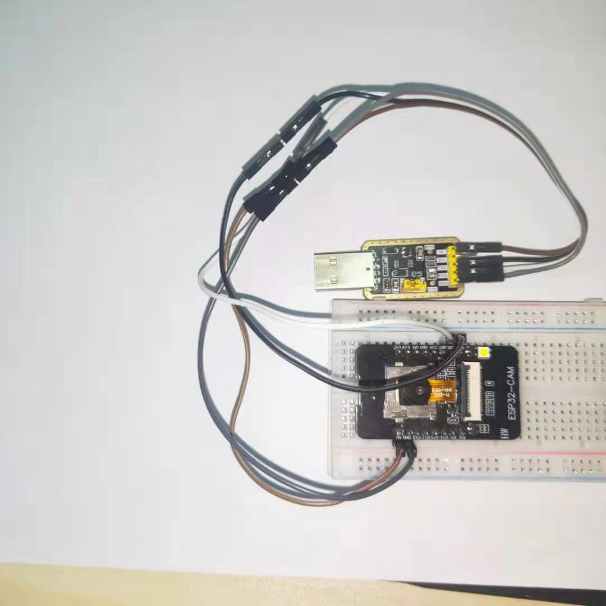
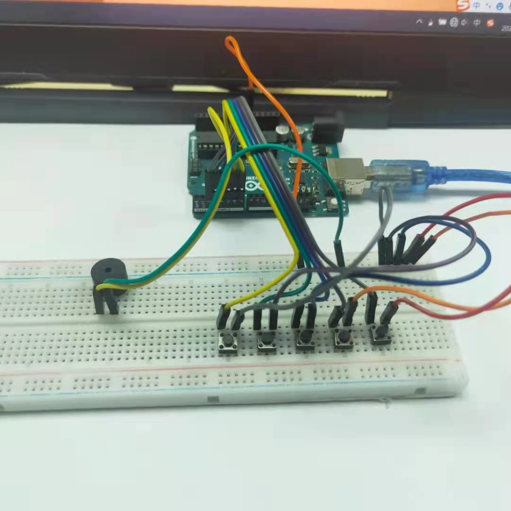
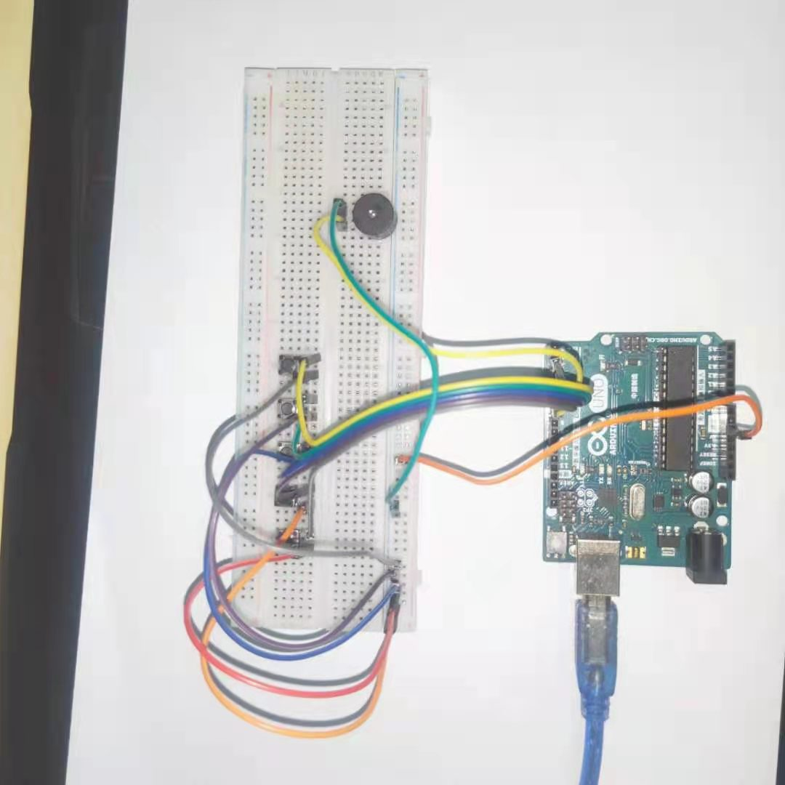

# Music Camera Doorbell
> A doorbell that takes pictures and plays music based on the Arduino Uno and ESP32-cam.

Principle of the procedure:
1. When a key is pressed, the corresponding port of the key will go low, and the program will record the level value to determine whether the key is pressed or not, so as to control the buzzer to make different sounds
2. The Arduino sends a square wave signal to drive the passive buzzer to make different sounds.
3. The ESP32-CAM is used to set up a LAN server to continuously upload the video stream from the camera to the server so that we can view the video via the URL.

## Configuration
### Hardware
1. 1*ESP32-CAM
2. 1*Arduino Uno 
3. 5*Tactile switch keys 
4. 1*Passive buzzer modules
5. Some wires
   
### Circuit wiring
 Disconnecting the Arduino from the computer
 
 Step 01  GND of the Arduino to the right pin of button 1 (the buttons are wired to the same side) 
 Step 02  Arduino pin 2 to the left pin of key 1 
 Step 03  GND of the Arduino to the right pin of key 2 
 Step 04  Arduino pin 3 to the left pin of key 2 
 Step 05  Arduino's GND to the right pin of key 3 
 Step 06  Arduino pin 4 to the left pin of key 3 
 Step 07  Arduino's GND to the right pin of key 4 
 Step 08  Arduino pin 5 to the left pin of key 4 
 Step 09  Arduino's GND to the right pin of key 5 
 Step 10  Arduino pin 6 to the left pin of key 5 
 Step 11  Arduino pin 7 to S (signal pin) of the buzzer module 
 Step 12  GND of Arduino to GND of buzzer module 
 Step 13  VCC of Arduino to VCC of buzzer module 

Connect the Arduino to the computer via USB

## Installation

##### Windows:
###### For ESP32-cam:
Step 1: Open the Arduino software, click on -> Tools -> Development Board and select "Esp32-Wrover Module". If the option "Esp32-Wrover Module" is not available, please make sure that the ESP32 development environment is successfully installed.  
Step 2: Click on -> Tools -> Ports to select the COM port of your own computer ESP32-CAM, usually starting from COM3, such as COM5, COM7 
Step 3: Click -> Tools -> Partition Scheme and select Huge-APP (3MB NO OTA/1MB SPIFFS) 
Step 4: You have to connect the GND pin of the ESP32-CAM development board to IO0 in order to upload the code 
Step 5: Click on upload and Leaving... appears. Hard resetting via RTS pin... The upload is complete. 
Step 6: Disconnect GND from IO0 and click RST (reset) on the development board for the program to run normally. 

###### For Arduino Uno:
Step 1: Open the Arduino software, click -> Tools -> Development Board and select "Arduino Uno". 
Step 2: Click on -> Tools -> Ports to select the COM port of your own computer Arduino, usually starting from COM3, such as COM5, COM7 
Step 3: Click Upload 

## Usage example

1. Turn on the serial monitor and you can see the key level data.
2. Press each of the 5 keys and they will make different sounds corresponding to do re mi fa so.
3. Open the serial monitor and print the URL of the serial port to access the video stream
4. Enter the URL in your browser to join the website and click Start Stream to display the web video stream normally
[Demo Video](https://youtu.be/z8LxL-7Nnn4)(YouTube)
## Details

## Upgrade suggestions
1. Consider 3D printing technology to design a housing for it that can be magnetically attached or glued to the door.
2. Intranet penetration for remote access.

## Meta

ZITING ZHAO – zzhao30@sheffield.ac.uk

[https://gitlab.com/zzhao30/com3505-student-2021](https://gitlab.com/zzhao30/com3505-student-2021)

## Reference 
[Arduino Documentation](https://docs.arduino.cc/)

<!-- Markdown link & img dfn's -->
